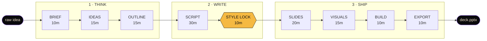
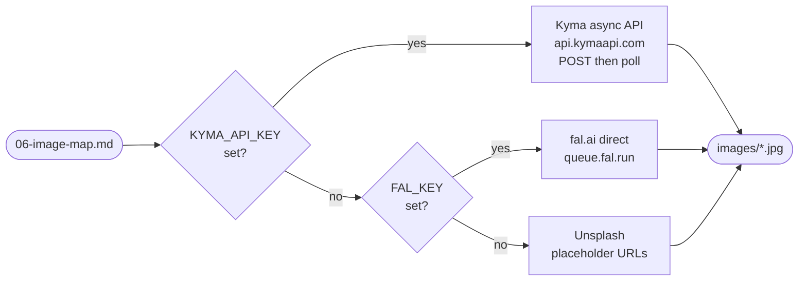

# talk-prep

Opinionated 9-phase skill for preparing cinematic public talks. Goes from raw idea → exported PPTX in ~90 minutes instead of 5 hours.

Works with Claude Code, Codex, Gemini CLI, Antigravity, Cursor, or standalone via `bun`.

---

## What you get

- A structured path: brief → ideas → outline → script → style lock → slide content → visuals → build → export.
- User gates between phases so style decisions do not arrive after slides exist.
- `founder-cinematic` preset (dark + Be Vietnam Pro + amber accent + editorial photography) based on a conference talk rated 7.5/10 on first pass.
- `gen-images.ts` — pluggable image generation. Kyma default, fal.ai fallback, Unsplash placeholder. Auto-discovers available models via registry.
- `html-to-pptx.ts` — text-editable PPTX export. Import to Canva / Google Slides / PowerPoint and keep editing.

---

## The flow at a glance



Total: ~135 min (1h 45m) end-to-end. Style lock (Phase 5) is the most important gate — locking visual tokens **before** slide content prevents the #1 time sink: retroactive design changes.

### What each phase produces

| Phase | Input | Output file | What it locks |
|---|---|---|---|
| 1 BRIEF | 1 paragraph about the talk | `00-brief.md` | audience + forbidden framings |
| 2 IDEAS | answers to 6 probe questions | `01-ideas.md` | 20–30 raw ideas (failures, stats, beliefs, quotes, scenes, taboos) |
| 3 OUTLINE | rank top 12 ideas | `02-outline.md` | narrative arc (4 options offered) |
| 4 SCRIPT | outline + arc | `03-script.md` | speakable text with `(pause)` and `[SLIDE N]` cues |
| 5 STYLE LOCK | preset choice or custom | `04-style-guide.md` | colors, fonts, photo mood — **frozen here** |
| 6 SLIDES | script + style | `05-slides.md` | one layout-tagged slide per `[SLIDE N]` |
| 7 VISUALS | image intents per slide | `06-image-map.md` + `images/*.jpg` | rendered photos via Kyma / fal.ai |
| 8 BUILD | slides + style + images | `deck.html` | working web deck (keyboard-navigable, 1920×1080) |
| 9 EXPORT | `deck.html` | `deck.pptx` | text-editable PPTX for Canva / Slides / PowerPoint |

### Provider chain (Phase 7)



---

## Install

### Option A — Claude Code

```bash
git clone https://github.com/sonpiaz/talk-prep ~/.claude/skills/talk-prep
cd ~/.claude/skills/talk-prep && bun install
```

Invoke with `/talk-prep` or ask any Claude Code conversation:

```
Read ~/.claude/skills/talk-prep/SKILL.md and apply it to my talk about [TOPIC].
```

### Option B — Other agents (Codex, Gemini CLI, Antigravity, Cursor)

```bash
git clone https://github.com/sonpiaz/talk-prep ./talk-prep
cd talk-prep && bun install
```

Tell the agent:

```
Read ./talk-prep/SKILL.md and follow the 9-phase workflow.
```

The SKILL.md uses plain markdown, no Claude-specific frontmatter. Any agent that can read files and run `bun` can execute it.

### Option C — Standalone CLI (no agent)

You write the markdown files yourself (following the templates), then run the scripts:

```bash
bun scripts/gen-images.ts --map ./my-talk/06-image-map.md --out ./my-talk/images
bun scripts/html-to-pptx.ts --in ./my-talk/deck.html --out ./my-talk/deck.pptx
```

---

## Quick start (Claude Code)

```
/talk-prep

I want to prepare a 40-minute workshop talk for 30 Vietnamese founders
about how AI made "build" 100× cheaper, titled "AI làm BUILD rẻ đi 100 lần".
Draw from my last year of shipping 29 repos solo.
```

The skill will walk you through 9 phases, each ending with a gate for you to approve before moving on.

---

## Environment variables

Set whichever you have. The `gen-images.ts` script picks the highest tier available.

```bash
# Tier 1 — Kyma (recommended, image models auto-discovered)
# Hits api.kymaapi.com/v1/images/generations (async job + poll).
export KYMA_API_KEY=kyma-xxxxxxxx

# Tier 2 — fal.ai direct (used if no KYMA_API_KEY)
export FAL_KEY=xxx:yyy

# Tier 3 — no key. Script uses Unsplash placeholders.
```

`KYMA_API_KEY` is recommended — Kyma routes to the best available image model for each intent (cinematic photo, Vietnamese text in image, logo, flat illustration) and gives you OpenAI-compatible access without managing multiple provider keys.

Get a Kyma key at [kymaapi.com](https://kymaapi.com).

---

## Directory layout

```
talk-prep/
├── SKILL.md                          # 9-phase workflow (read this first)
├── README.md                         # This file
├── LICENSE                           # MIT
├── package.json
├── tsconfig.json
├── templates/
│   ├── 00-brief.md
│   ├── 01-ideas.md
│   ├── 02-outline.md
│   ├── 03-script.md
│   ├── 04-style-guide.md
│   ├── 05-slides.md
│   └── 06-image-map.md
├── presets/
│   └── founder-cinematic/
│       ├── style.md
│       ├── html-scaffold.html
│       ├── image-prompts.md
│       └── README.md
├── scripts/
│   ├── gen-images.ts                 # Kyma → fal.ai → Unsplash
│   └── html-to-pptx.ts               # text-editable PPTX
├── config/
│   └── kyma-registry-fallback.json
└── prompts/
    ├── brainstorm-socratic.md
    └── style-extract-from-pdf.md
```

---

## Roadmap

**v0.1 (shipped):** founder-cinematic preset, Kyma/fal.ai/Unsplash chain, 9-phase flow, MIT. Verified end-to-end against live `api.kymaapi.com` 2026-04-25 — 3 images parallel in 15.6s for $0.27.

**v0.2:** `clean-briefing` preset (light + neutral + serif, for investor decks), `photo-narrative` preset (documentary photojournalism), `examples/` folder with 2–3 past decks, video/audio embed support.

**v0.3:** teleprompter-mode HTML export, live speaker-notes sidebar, automatic cue-card PDF.

---

## Philosophy

Most deck tools optimize for drag-drop convenience and produce slides that look like every other deck. This skill optimizes for **editorial typography + cinematic imagery** and forces you to lock style **before** writing slide content, because retroactive style changes are the #1 time sink.

It is opinionated on purpose. If you want unlimited templates, use Canva.

---

## Contributing

This is v0.1. Open issues on GitHub for:

- Preset requests (describe the aesthetic + a reference image).
- Agent compatibility bugs (tell us which agent + what failed).
- Prompt improvements.

PRs welcome. Keep the skill dependency footprint small — the appeal is that it runs with `bun` alone.

---

## License

MIT. Copyright (c) 2026 Son Piaz (Nguyễn Tùng Sơn).
